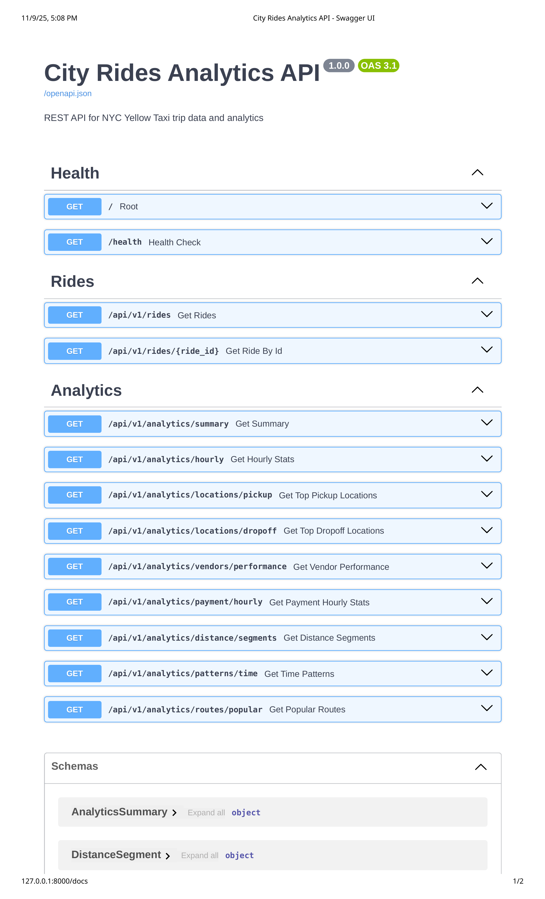
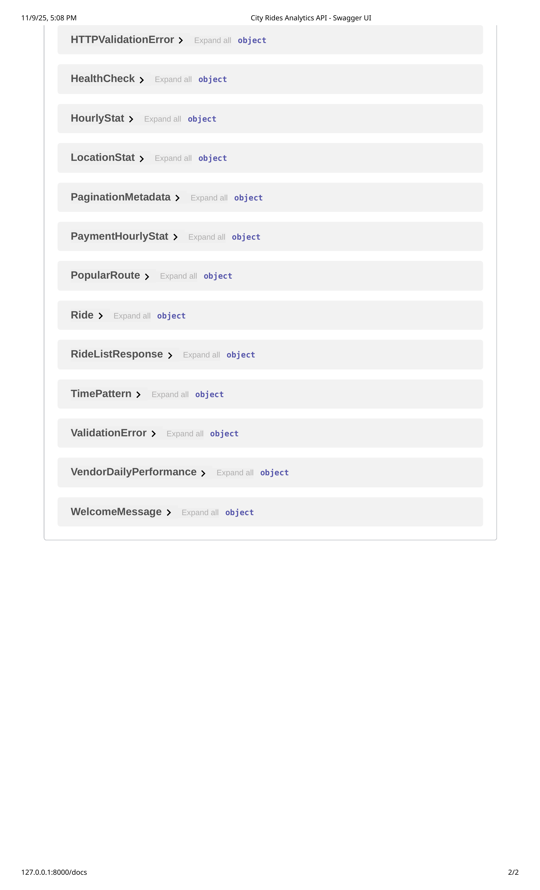
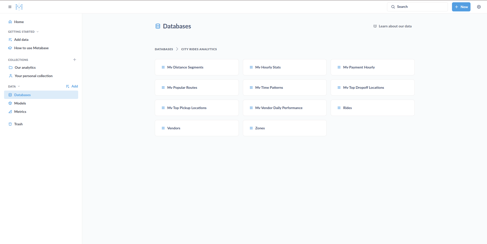
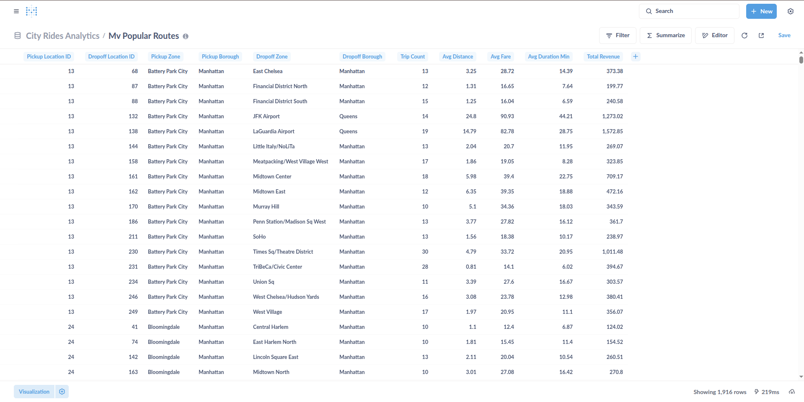

# City Rides Analytics Dashboard

A comprehensive data analytics platform for analyzing NYC Yellow Taxi trip data
using PostgreSQL, Python, and modern data engineering practices.

## 🎯 Project Overview

This project analyzes NYC taxi trip patterns, vendor performance, and customer behavior
using real TLC (Taxi & Limousine Commission) data.

**Key Features:**

- ✅ PostgreSQL database with optimized schema and 9 materialized views
- ✅ Python ETL pipeline for data loading (93K+ rides loaded)
- ✅ Advanced SQL analytics (window functions, CTEs, aggregations)
- ✅ High-performance RESTful API with FastAPI (14 endpoints)
- ✅ Connection pooling for production-ready performance (1,353 req/s)
- ✅ Performance monitoring with `/metrics` endpoint
- 🚧 Metabase dashboards (4 dashboards in progress)
- 🎯 Phase 5: Scale & Real-Time Readiness (planned)

**Status:** **Phase 4 In Progress** - Visualization & Dashboards 🚧

**Next:** Phase 5 will evaluate scaling strategies, incremental refresh optimization, and DuckDB/Parquet for analytics at scale (3M+ rows).

## 📚 Documentation

Complete documentation is available in the `docs/` folder:

- **[docs/INDEX.md](docs/INDEX.md)** - Documentation index and navigation
- **[docs/human/](docs/human/)** - User guides and references
- **[docs/ai/](docs/ai/)** - AI assistant context

### Quick Links

- [Setup Guide](docs/human/SETUP.md) - Installation instructions
- [Implementation Guide](docs/human/IMPLEMENTATION_GUIDE.md) - 25-step
  implementation plan
- [Database Documentation](docs/human/DATABASE.md) - Schema and queries
- [Analytics Guide](docs/human/ANALYTICS.md) - SQL query examples

## 🚀 Quick Start

### Prerequisites

- Python 3.9+
- PostgreSQL 14+
- 8GB RAM minimum

### Installation

1. **Clone the repository**

   ```bash
   cd Yellow_Taxi_Trips_Analytics
   ```

2. **Set up Python environment**

   ```bash
   python3 -m venv venv
   source venv/bin/activate
   pip install -r requirements.txt
   ```

3. **Configure database**

   ```bash
   # Copy and edit environment file
   cp .env.example .env
   # Edit .env with your database credentials
   ```

4. **Set up PostgreSQL**

   ```bash
   sudo -u postgres psql
   # In psql:
   CREATE DATABASE city_rides_db;
   CREATE USER rides_user WITH PASSWORD 'your_password';
   GRANT ALL PRIVILEGES ON DATABASE city_rides_db TO rides_user;
   \c city_rides_db
   GRANT ALL ON SCHEMA public TO rides_user;
   \q
   ```

5. **Initialize database schema**

   ```bash
   psql -U rides_user -d city_rides_db -h localhost -f sql/schema.sql
   ```

6. **Run ETL pipeline**

   ```bash
   python src/etl/load_data.py
   ```

7. **Start the API server**

   ```bash
   cd src/api
   python main.py
   # API will be available at http://localhost:8000
   # API docs at http://localhost:8000/docs
   ```

8. **(Optional) Start Metabase**

   ```bash
   docker start metabase
   # Access at http://localhost:3000
   ```

## 📁 Project Structure

```text
Yellow_Taxi_Trips_Analytics/
├── data/                   # Data files (gitignored)
├── docs/                   # Documentation
│   ├── human/             # User documentation
│   └── ai/                # AI assistant context
├── sql/                   # SQL scripts
│   ├── schema.sql         # Database schema
│   └── queries/           # Analysis queries
├── src/                   # Source code
│   ├── etl/              # ETL pipeline
│   ├── api/              # API (planned)
│   └── analytics/        # Analytics modules
├── config/                # Configuration
├── tests/                 # Tests
├── .env                   # Environment variables (not committed)
├── .gitignore            # Git ignore rules
└── requirements.txt      # Python dependencies
```

## 🔧 Technology Stack

- **Database:** PostgreSQL 14+
- **ETL:** Python, pandas, pyarrow
- **API:** FastAPI, Uvicorn
- **Visualization:** Metabase (Docker) - ready for dashboard creation
- **Development:** python-dotenv, SQLAlchemy, psycopg2

## 📊 Dataset

NYC Taxi & Limousine Commission (TLC) - Yellow Taxi Trip Records

- Source: <https://www.nyc.gov/site/tlc/about/tlc-trip-record-data.page>
- Current data: September 2025 (~3M rows)

## 🎯 Project Status

**Phase 1: Foundation** ✅ **COMPLETED**

- [x] Documentation created (10 files, 3,500+ lines)
- [x] Project structure set up
- [x] Database schema designed (3 tables, 6 indexes)
- [x] ETL pipeline created and tested
- [x] Initial data load (93,171 rides + 265 zones)
- [x] Data validation and verification
- [x] Basic analytics queries created

**Phase 2: Analysis** ✅ **COMPLETED**

- [x] Basic analytics queries
- [x] Advanced analytics (window functions, CTEs)
- [x] Query optimization with EXPLAIN ANALYZE
- [x] Materialized views (8 views, 712 KB)
- [x] Performance monitoring queries

**Phase 3: API Layer** ✅ **COMPLETED**

- [x] FastAPI application structure
- [x] Health and CRUD endpoints
- [x] Analytics API endpoints (9 analytics endpoints)
- [x] Automatic API documentation (Swagger/ReDoc)
- [x] Database service layer with connection pooling
- [x] Pydantic models for type-safe validation

**Phase 3.5: Performance Optimization** ✅ **COMPLETED**

- [x] Load testing and bottleneck identification
- [x] Connection pooling implementation (2-20 connections)
- [x] Additional materialized view (mv_analytics_summary)
- [x] Performance monitoring endpoint (/metrics)
- [x] 53x performance improvement under load
- [x] Production-ready API (1,353 req/s throughput)

**Phase 4: Visualization** 🚧 **IN PROGRESS**

- [x] Metabase installation (Docker)
- [x] PostgreSQL connection configured
- [x] Schema synced (3 tables + 8 materialized views)
- [ ] Dashboard creation (4 dashboards planned)
- [ ] Interactive filters and drill-downs

**Phase 5: Scale & Real-Time Readiness** 🎯 **PLANNED**

**Goal:** Evaluate scaling strategies, optimize for production-scale workloads, and prepare for real-time scenarios.

- [ ] **5.1 Benchmarking** - Test at 500K, 1M, 3M rows to identify breaking points
- [ ] **5.2 Incremental Refresh** - Implement hot/cold data partitioning (30-day rolling window)
- [ ] **5.3 DuckDB Evaluation** - Test columnar storage (Parquet) for analytical workloads
- [ ] **5.4 Hybrid Architecture** - Optional: PostgreSQL (operational) + DuckDB (analytical)
- [ ] **5.5 Streaming Assessment** - Document real-time readiness (TimescaleDB/Kafka/Arc)

**Expected Outcomes:**
- 80-90% reduction in materialized view refresh time for large datasets
- Production-ready scaling strategy for 10M+ rows
- Decision matrix for columnar storage vs materialized views
- Comprehensive performance benchmarks and optimization guide

See [docs/ai/PHASE5_SUMMARY.md](docs/ai/PHASE5_SUMMARY.md) for detailed plan.

## 📝 Usage Examples

### Start the API Server

```bash
cd src/api
python main.py
```

The API will be available at:

- **Base URL:** <http://localhost:8000>
- **Interactive Docs:** <http://localhost:8000/docs>
- **ReDoc:** <http://localhost:8000/redoc>
- **Performance Metrics:** <http://localhost:8000/metrics>

### API Examples

```bash
# Health check
curl http://localhost:8000/health

# Get rides with pagination
curl "http://localhost:8000/api/v1/rides?page=1&page_size=10"

# Get analytics summary
curl http://localhost:8000/api/v1/analytics/summary

# Get hourly statistics
curl http://localhost:8000/api/v1/analytics/hourly

# Get performance metrics
curl http://localhost:8000/metrics
```

### Load Data

```bash
# Load sample (100k rows)
python src/etl/load_data.py

# Load full dataset (edit load_data.py to remove sample_size parameter)
```

### Query Data Directly

```bash
psql -U rides_user -d city_rides_db -h localhost

# Example queries
SELECT COUNT(*) FROM rides;
SELECT vendor_name, COUNT(*) FROM rides r
JOIN vendors v ON r.vendor_id = v.vendor_id
GROUP BY vendor_name;
```

### Refresh Materialized Views

```bash
# Refresh all 9 materialized views for updated dashboard data
./scripts/refresh_materialized_views.sh
```

### Run Load Tests

```bash
# Test API performance under concurrent load
ab -n 1000 -c 10 http://localhost:8000/api/v1/analytics/summary
```

## 🖼️ Screenshots

### API Documentation

The FastAPI application provides interactive API documentation with automatic
request/response examples:





### Analytics Examples

List of available analytics endpoints:



### Data Visualizations

Distance segments analysis showing fare distribution by trip distance:


Popular routes table showing the most frequent pickup-dropoff pairs:



## 🤝 Contributing

This is a learning project. See [IMPLEMENTATION_GUIDE.md](docs/human/IMPLEMENTATION_GUIDE.md)
for the complete development roadmap.

## 📧 Support

For detailed information, check the documentation in `docs/human/`.

---

**Last Updated:** November 12, 2025
**Version:** 1.1.0
**Status:** Phase 4.5 Complete - Production-Ready API
